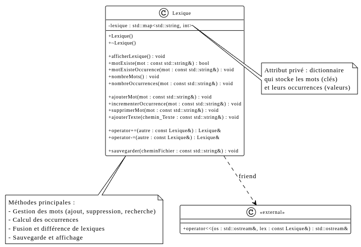

# Rapport TP1 - Lexique

Titouan Copin Simon Cau
## Table des matières
- [Rapport TP1 - Lexique](#rapport-tp1---lexique)
  - [Table des matières](#table-des-matières)
  - [Introduction](#introduction)
  - [Fonctions de base de la classe Lexique](#fonctions-de-base-de-la-classe-lexique)
    - [Fonction ajouterMot](#fonction-ajoutermot)
    - [Principe](#principe)
    - [Fonction incrementerOccurrence](#fonction-incrementeroccurrence)
    - [Principe](#principe-1)
    - [Fonction motExiste](#fonction-motexiste)
    - [Principe](#principe-2)
    - [Fonction supprimerMot](#fonction-supprimermot)
    - [Principe](#principe-3)
    - [Fonction operator\<\<](#fonction-operator)
    - [Principe](#principe-4)
  - [Algorithmes implémentés](#algorithmes-implémentés)
    - [Fusion de lexiques (operator+=)](#fusion-de-lexiques-operator)
      - [Description](#description)
      - [Algorithme](#algorithme)
      - [Principe](#principe-5)
    - [Différence de lexiques (operator-=)](#différence-de-lexiques-operator-)
      - [Description](#description-1)
      - [Algorithme](#algorithme-1)
      - [Principe](#principe-6)
  - [Jeux d'essais](#jeux-dessais)
    - [Test 1 : Fusion](#test-1--fusion)
    - [Test 2 : Différence avec suppression](#test-2--différence-avec-suppression)
    - [Test 3 : Différence avec suppression complète](#test-3--différence-avec-suppression-complète)
  - [Algorithme implémentés en partie 2](#algorithme-implémentés-en-partie-2)
    - [Fichier hpp](#fichier-hpp)
    - [Fichier cpp](#fichier-cpp)
      - [Fonction AddWord](#fonction-addword)
      - [Principe](#principe-7)
      - [Fonction AddText](#fonction-addtext)
      - [Principe](#principe-8)
      - [Fonction operator\<\<](#fonction-operator-1)
      - [Principe](#principe-9)
      - [Fonction operator+=](#fonction-operator-2)
      - [Principe](#principe-10)
      - [Fonction operator-=](#fonction-operator-)
      - [Principe](#principe-11)
      - [Fonction operator-=](#fonction-operator--1)
      - [Fonction WriteLex](#fonction-writelex)
      - [Principe](#principe-12)
      - [Fonction CountWord](#fonction-countword)
  - [Test sur les texte](#test-sur-les-texte)
    - [main.cpp :](#maincpp-)
  - [Conclusion](#conclusion)


## Introduction

Ce rapport présente l'implémentation de deux algorithmes fondamentaux pour la manipulation de lexiques :

- **Fusion** : Combiner deux lexiques en additionnant les occurrences
- **Différence** : Soustraire les occurrences d'un lexique à un autre
![UML\UML.png]
La classe `Lexique` utilise une `std::map<std::string, int>` pour stocker les mots et leurs occurrences, garantissant un ordre alphabétique automatique.

## Fonctions de base de la classe Lexique

### Fonction ajouterMot

```cpp
void Lexique::ajouterMot(const std::string& mot) {
    lexique[mot]++;
}
```

### Principe
1. **Accès ou création** : Utilise l'opérateur `[]` de la map qui crée automatiquement une entrée avec la valeur 0 si le mot n'existe pas
2. **Incrémentation** : Augmente le compteur d'occurrences de 1
3. **Résultat** : Le mot est ajouté avec 1 occurrence ou son compteur est incrémenté

### Fonction incrementerOccurrence

```cpp
void Lexique::incrementerOccurrence(const std::string& mot) {
    if (motExiste(mot)) {
        lexique[mot]++;
    }
}
```

### Principe
1. **Vérification** : Contrôle l'existence du mot dans le lexique via `motExiste`
2. **Incrémentation conditionnelle** : Augmente le compteur seulement si le mot existe
3. **Sécurité** : Évite la création involontaire de nouvelles entrées

### Fonction motExiste

```cpp
bool Lexique::motExiste(const std::string& mot) const {
    return lexique.find(mot) != lexique.end();
}
```

### Principe
1. **Recherche** : Utilise la méthode `find` de la map pour localiser le mot
2. **Comparaison** : Compare l'itérateur retourné avec `end()` pour déterminer l'existence
3. **Retour booléen** : Retourne `true` si trouvé, `false` sinon

### Fonction supprimerMot

```cpp
void Lexique::supprimerMot(const std::string& mot) {
    lexique.erase(mot);
}
```

### Principe
1. **Suppression directe** : Utilise la méthode `erase` de la map avec la clé
2. **Nettoyage** : Retire complètement l'entrée du lexique
3. **Sécurité** : La méthode `erase` n'a aucun effet si la clé n'existe pas

### Fonction operator<<

```cpp
std::ostream& operator<<(std::ostream& os, const Lexique& lex) {
    for (const auto& pair : lex.lexique) {
        os << pair.first << ": " << pair.second << std::endl;
    }
    return os;
}
```

### Principe
1. **Parcours ordonné** : Itère sur la map qui maintient l'ordre alphabétique automatiquement
2. **Formatage** : Affiche chaque mot suivi de ses occurrences au format "mot: nombre"
3. **Retour de flux** : Retourne le flux de sortie pour permettre le chaînage d'opérations

## Algorithmes implémentés

### Fusion de lexiques (operator+=)

#### Description
L'opérateur `+=` fusionne deux lexiques en additionnant les occurrences de chaque mot.

#### Algorithme
```cpp
Lexique& Lexique::operator+=(const Lexique& autre) {
    for (const auto& pair : autre.lexique) {
        this->lexique[pair.first] += pair.second;
    }
    return *this;
}
```

#### Principe
1. **Parcours** : Itère sur tous les mots du lexique `autre`
2. **Addition** : Pour chaque mot trouvé :
   - Si le mot existe déjà dans `this`, additionne les occurrences
   - Si le mot n'existe pas, l'opérateur `[]` le crée avec la valeur donnée
3. **Retour** : Retourne une référence vers `this` pour permettre le chaînage

### Différence de lexiques (operator-=)

#### Description
L'opérateur `-=` soustrait les occurrences d'un lexique à un autre, supprimant les mots dont le compte devient ≤ 0.

#### Algorithme
```cpp
Lexique& Lexique::operator-=(const Lexique& autre) {
    for (const auto& pair : autre.lexique) {
        if(motExiste(pair.first)){
            this->lexique[pair.first] -= pair.second;
            if (this->lexique[pair.first] <= 0) {
                supprimerMot(pair.first);
            }
        }
    }
    return *this;
}
```

#### Principe
1. **Parcours** : Itère sur tous les mots du lexique `autre`
2. **Vérification** : Vérifie si le mot existe dans `this`
3. **Soustraction** : Soustrait les occurrences
4. **Nettoyage** : Si le résultat ≤ 0, supprime le mot complètement
5. **Retour** : Retourne une référence vers `this`


## Jeux d'essais

### Test 1 : Fusion 

```cpp
// Initialisation
Lexique lex1, lex2;

// Lexique 1
lex1.ajouterMot("chat");         // chat: 1
lex1.ajouterMot("chien");        // chien: 1
lex1.incrementerOccurrence("chat"); // chat: 2

// Lexique 2
lex2.ajouterMot("chat");         // chat: 1
lex2.ajouterMot("oiseau");       // oiseau: 1

// Fusion
lex1 += lex2;

// Résultat attendu dans lex1:
// chat: 3 (2 + 1)
// chien: 1
// oiseau: 1
```

**Sortie console :**
```
chat: 3
chien: 1
oiseau: 1
```

### Test 2 : Différence avec suppression

```cpp
// Initialisation
Lexique lex1, lex2;

// Lexique 1
lex1.ajouterMot("chat");         // chat: 1
lex1.ajouterMot("chien");        // chien: 1

// Lexique 2
lex2.ajouterMot("chat");         // chat: 1
lex2.ajouterMot("oiseau");       // oiseau: 1 (n'existe pas dans lex1)

// Différence
lex1 -= lex2;

// Résultat attendu dans lex1:
// chien: 1 (inchangé)
// oiseau n'affecte pas lex1
```

**Sortie console :**
```
chien: 1
```

### Test 3 : Différence avec suppression complète

```cpp
// Initialisation
Lexique lex1, lex2;

// Lexique 1
lex1.ajouterMot("chat");         // chat: 1
lex1.ajouterMot("chien");        // chien: 1

// Lexique 2
lex2.ajouterMot("chat");         // chat: 1

// Différence
lex1 -= lex2;

// Résultat attendu dans lex1:
// chat: supprimé (1 - 2 = -1 ≤ 0)
// chien: 1 (inchangé)
```

**Sortie console :**
```
chien: 1
```


## Algorithme implémentés en partie 2

Cette partie est sur le code fait par Simon disponible sur l'autre branche.

### Fichier hpp

```cpp
#pragma once

#include "lexique.hpp"
#include <map>
#include <list>

using namespace std;

class LexiqueLine : public Lexique {
    private :
    map<string , list<int> > lexique_line;

    public :

    //Setters
    void AddWord(string word, int line);
    void AddTxt(string texte_txt);
    void DeleteWord(string word);
    void WriteLex();  

    int CountWord() const;             

    //Guetteurs
    //void IterationsWord(string word);


    //Surchages
    void operator+=(const LexiqueLine& Lex2);
    void operator-=(LexiqueLine Lex2);
    friend ostream& operator<<(ostream& os, const LexiqueLine& Lex);
};
```

### Fichier cpp

#### Fonction AddWord

```cpp
void LexiqueLine::AddWord(string word, int line){
    this->lexique_line[word].push_back(line);
}
```

#### Principe
1. **Recherche** : Accède à la clé correspondant au mot dans la map `lexique_line` (créée automatiquement si elle n’existe pas).  
2. **Insertion** : Ajoute le numéro de ligne `line` dans la liste associée à ce mot.  
3. **Association** : Chaque mot est lié à toutes les lignes où il apparaît dans le texte.  
4. **Mise à jour** : Si le mot réapparaît, le nouveau numéro de ligne est simplement ajouté à la suite de la liste existante.  
5. **Résultat** : Le lexique associe chaque mot à la liste complète des lignes où il est rencontré.


#### Fonction AddText

```cpp
void LexiqueLine::AddTxt(string path_txt){

    int line = 1;                 
    string line_str;   

    // Import txt en string
    string text;
    if (!util::readFileIntoString(path_txt, text)) {
        cerr << "le fichier n'a pas pu etre lu !\n";
    return;                    
    }

    istringstream in(text);
    while (getline(in, line_str)) { 
        char* line_dup = strdup(line_str.c_str());

        for (char* token = strtok(line_dup, " ,.-\t"); token != nullptr; token = strtok(nullptr, " ,.-\t")){

            this->AddWord(string(token), line);

        }

        ++line;

        free(line_dup);
    }
}
```

#### Principe
1. **Lecture** : Lit le contenu du fichier texte spécifié par `path_txt` et le charge dans une chaîne de caractères.  
2. **Découpage par ligne** : Parcourt le texte ligne par ligne à l’aide de `std::getline`, en incrémentant un compteur de lignes `line`.  
3. **Tokenisation** : Pour chaque ligne, duplique la chaîne et la découpe en mots grâce à `strtok`, en utilisant les espaces et signes de ponctuation comme séparateurs.  
4. **Ajout au lexique** : Chaque mot extrait est ajouté au lexique à l’aide de `AddWord`, avec le numéro de ligne correspondant.  
5. **Libération mémoire** : Après traitement d’une ligne, la mémoire allouée par `strdup` est libérée.  
6. **Résultat** : Chaque mot du fichier est enregistré dans la map `lexique_line`, associé à toutes les lignes où il apparaît.


#### Fonction operator<<

```cpp
ostream& operator<<(ostream& os, const LexiqueLine& Lex) {
    std::map<string, list<int> >::const_iterator it;
    for (it = Lex.lexique_line.begin(); it != Lex.lexique_line.end(); ++it) {

        os << it->first 
        << " : lignes = ";

        list<int>::const_iterator it2;
        for (it2 = it->second.begin(); it2 != it->second.end(); ++it2) {
            os << *it2;
            if (next(it2) != it->second.end())
                os << ", ";
        }

        os << std::endl;
    }

    return os;
}
```
#### Principe
1. **Itération principale** : Parcourt la map `lexique_line` afin de traiter chaque mot du lexique dans l’ordre alphabétique.  
2. **Affichage du mot** : Pour chaque entrée, affiche la clé (`it->first`), correspondant au mot, suivie du texte `" : lignes = "`.  
3. **Itération secondaire** : Parcourt la liste associée au mot (`it->second`) pour afficher tous les numéros de lignes.  
4. **Mise en forme** : Sépare les numéros de lignes par des virgules, en évitant d’en placer une après le dernier élément grâce à `std::next(it2)`.  
5. **Résultat** : Retourne le flux `os` contenant la représentation textuelle complète du lexique, où chaque mot est suivi de la liste des lignes dans lesquelles il apparaît.

#### Fonction operator+=

```cpp
void LexiqueLine::operator+=(const LexiqueLine& Lex2) {
    for (const auto& pair : Lex2.lexique_line) {
        const string& word = pair.first;
        const list<int>& lines = pair.second;

        for (int line : lines) {
            this->AddWord(word, line);  
        }
    }
}
```

#### Principe
1. **Parcours** : Itère sur toutes les entrées de la map `lexique_line` du lexique `Lex2`.  
2. **Récupération des données** : Pour chaque paire clé–valeur, récupère le mot (`word`) et la liste de ses numéros de lignes (`lines`).  
3. **Insertion** : Pour chaque numéro de ligne de `Lex2`, appelle la fonction `AddWord` afin d’ajouter ce mot et sa ligne correspondante dans le lexique courant (`this`).  
4. **Fusion** : Si le mot existe déjà, ses nouvelles lignes sont ajoutées à la suite de celles existantes.  
5. **Résultat** : Le lexique courant contient désormais l’union des mots et de leurs lignes issus des deux lexiques.

#### Fonction operator-=

```cpp
void LexiqueLine::operator-=(LexiqueLine Lex2){
    for (const auto& pair : Lex2.lexique_line)
    {
        this->DeleteWord(pair.first);
    }
}
```

#### Principe
1. **Parcours** : Itère sur toutes les entrées de la map `lexique_line` du lexique `Lex2`.  
2. **Identification** : Pour chaque paire clé–valeur, récupère le mot (`pair.first`) à supprimer.  
3. **Suppression** : Appelle la fonction `DeleteWord` pour retirer ce mot de la map `lexique_line` du lexique courant (`this`).  
4. **Nettoyage** : Si le mot n’existe pas dans le lexique courant, aucune action n’est effectuée.  
5. **Résultat** : Le lexique courant ne contient plus les mots présents dans `Lex2`, réalisant ainsi une opération de différence entre les deux lexiques.

#### Fonction operator-=

```cpp
void LexiqueLine::DeleteWord(string word) {
    this->lexique_line.erase(word);
}
```
#### Fonction WriteLex

```cpp
void LexiqueLine::WriteLex() {
    std::ofstream file("LexiqueLine.txt");
    if (file.is_open()) {
        for (const auto& it3 : this->lexique_line) {
            file << "Mot : " << it3.first << "  lignes : ";

            bool first = true;
            for (int ln : it3.second) {
                if (!first) file << ", ";
                file << ln;
                first = false;
            }
            file << endl;
        }
        file.close(); 
    } 
    else {
        cerr << "Erreur : impossible d'ouvrir le fichier LexiqueLine.txt" << endl;
    }
}
```

#### Principe  
1. **Ouverture du fichier** : Crée et ouvre un flux de sortie vers le fichier `LexiqueLine.txt` à l’aide d’un objet `ofstream`.  
2. **Vérification** : Contrôle que le fichier est bien ouvert avant d’écrire pour éviter toute erreur d’accès.  
3. **Parcours du lexique** : Itère sur toutes les entrées de la map `lexique_line`, où chaque clé représente un mot et la valeur associée une liste de numéros de lignes.  
4. **Écriture formatée** : Pour chaque mot, écrit dans le fichier la forme `Mot : <mot>  lignes : <liste_de_lignes>`, en séparant les numéros de lignes par des virgules.  
5. **Fermeture du fichier** : Une fois toutes les données écrites, le fichier est refermé proprement à l’aide de `file.close()`.  
6. **Gestion d’erreur** : Si le fichier ne peut pas être ouvert, affiche un message d’erreur sur la sortie standard d’erreur (`cerr`).  
7. **Résultat** : Le contenu complet du lexique est sauvegardé dans un fichier texte, permettant sa consultation ou sa réutilisation ultérieure.


#### Fonction CountWord

```cpp
int LexiqueLine::CountWord() const {
    return static_cast<int>(lexique_line.size());
}
```

## Test sur les texte

### main.cpp :

```cpp
#include "utilitaire.hpp"
#include <iostream>
#include "lexique.hpp"
#include "lexique_line.hpp"


int main(int argc, char** argv) {

    // on crée les lexiques
	LexiqueLine Dict_NDDP; 
	LexiqueLine Dict_LM;

     // ajoute les mots de chaque textes
    Dict_LM.AddTxt("./lesMiserables_A.txt");
	Dict_NDDP.AddTxt("./notreDameDeParis_A.txt");

    // On affiche le nombre de mots contenus dans Notre Dame De Paris
    // et de Les Mésirables
	cout << Dict_NDDP.CountWord();
	cout << "\n";

	cout << Dict_LM.CountWord();
	cout << "\n";

    // On affiche les mots et leurs lignes 
	cout << Dict_LM;

    // On écrit dans le fichier le lexique
	Dict_LM.WriteLex();
}
```

**Sortie console :**
```
21857
40844
...
Écouen : lignes = 22920, 22922
Édon : lignes = 6864
Édon's : lignes = 6861, 6873
Églantiers : lignes = 23375
Éloy : lignes = 12022, 12103
Élysée : lignes = 16432
Élysées : lignes = 6455, 6470, 6494, 6999, 7015, 27357, 41926, 51383, 57866, 58239, 58730, 58747, 59165, 59175, 59605, 59659, 62016, 62048
...
```

**Fichier texte :**
```
Mot : Alvarès  lignes : 33414, 33641, 65784
Mot : Alveras  lignes : 33509
Mot : Alvinzi  lignes : 16293
Mot : Always  lignes : 24561, 30264
Mot : Alzey  lignes : 28254
Mot : Alèthe  lignes : 24975
Mot : Am  lignes : 10689, 41062, 42773
Mot : Amasie  lignes : 5992
Mot : Amazement  lignes : 58387
Mot : Amazon  lignes : 30606
Mot : Ambassador  lignes : 28072
Mot : Ambassadors  lignes : 62293
Mot : Ambigu  lignes : 44343
Mot : Ambiorix  lignes : 51732, 51733
...
```


## Conclusion 

L'implémentation présentée offre une base solide pour des applications de traitement de texte nécessitant des opérations sur des lexiques.

